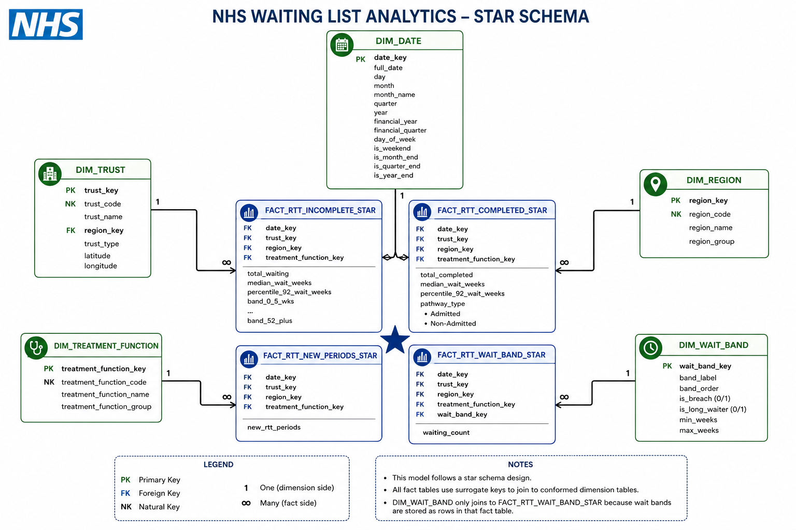

# NHS Waiting List Analytics — Complete Project Documentation

> A complete guide for anyone unfamiliar with this project: the business context, the data,
> the technology, the analytical findings, and how everything fits together.

---

## Table of Contents

1. [What is this project?](#1-what-is-this-project)
2. [The NHS — Background and Business Context](#2-the-nhs--background-and-business-context)
3. [The Waiting List Problem](#3-the-waiting-list-problem)
4. [The Data Source — NHS England RTT Statistics](#4-the-data-source--nhs-england-rtt-statistics)
5. [The Data Model — How the Data is Structured](#5-the-data-model--how-the-data-is-structured)
6. [The Database Architecture — MySQL Star Schema](#6-the-database-architecture--mysql-star-schema)
7. [The Cloud Analytics Track — Databricks](#7-the-cloud-analytics-track--databricks)
8. [The Data Pipeline](#8-the-data-pipeline)
9. [The Analytics Layer — SQL Views](#9-the-analytics-layer--sql-views)
10. [Key Performance Indicators (KPIs)](#10-key-performance-indicators-kpis)
11. [Key Findings from the Data](#11-key-findings-from-the-data)
12. [The Power BI Dashboard](#12-the-power-bi-dashboard)
13. [Project File Structure](#13-project-file-structure)
14. [How to Reproduce This Project](#14-how-to-reproduce-this-project)
15. [NHS Glossary](#15-nhs-glossary)

---

## 1. What is this project?

This is a **data engineering and healthcare analytics portfolio project** that answers a real-world question:

> *Is the NHS waiting list improving because more patients are being treated — or because fewer patients are entering the system in the first place?*

To answer that question, this project:

1. Downloads **real, public NHS England RTT data** — ~600 monthly Excel files covering April 2019 to December 2025
2. Builds a **Python ETL pipeline** to clean and standardise the raw files
3. Models the data into a **MySQL star schema data warehouse** with 3 fact tables and 5 dimension tables
4. Builds a parallel **Databricks Delta Lake** implementation on top of the same processed data
5. Creates **SQL analytical mart views** to compute demand, throughput, and backlog KPIs
6. Surfaces the analysis in a **5-page Power BI dashboard**

**The result:** An end-to-end analytics pipeline covering **all NHS England provider trusts** across **80 monthly periods (April 2019 – December 2025)**, with over 1.4 million fact rows, surfacing a clear story about referral suppression and backlog growth.

---

## 2. The NHS — Background and Business Context

### What is the NHS?

The **National Health Service (NHS)** is England's publicly funded healthcare system, established in 1948. It provides most healthcare free at the point of use, funded through general taxation. It is one of the largest employers in the world.

### What is an NHS Trust?

NHS care is delivered by organisations called **Trusts** — legal entities responsible for running hospitals, mental health services, ambulance services, or community services. Each Trust is identified by a unique **ODS (Organisation Data Service) code**, a 3–6 character alphanumeric identifier (e.g. `RJ1` = King's College Hospital NHS Foundation Trust).

### What is the RTT pathway?

The **Referral to Treatment (RTT)** pathway is the NHS framework for managing patient journeys from first referral through to treatment. It is the primary mechanism for tracking how long patients wait for elective care.

| Stage | What it means |
| --- | --- |
| **New period** | A new RTT clock starts — a patient enters the pathway |
| **Incomplete pathway** | The patient is still waiting; has not yet received definitive treatment |
| **Completed admitted** | The patient received inpatient or day-case treatment |
| **Completed non-admitted** | The patient was treated without admission (e.g. outpatient procedure) |

The **18-week standard** requires that 92% of patients begin treatment within 18 weeks of referral. This standard has not been met nationally since July 2015.

### How is waiting list performance measured?

- **Breach rate**: percentage of incomplete pathways waiting more than 18 weeks
- **52+ week waiters**: patients waiting over a year; a politically sensitive extreme-wait metric
- **P92 wait**: the 92nd percentile wait time in weeks (directly linked to the 18-week target)
- **Referral-to-Treatment ratio**: new referrals divided by completed treatments — the demand/supply balance measure

---

## 3. The Waiting List Problem

### Why this project matters

The NHS waiting list grew from **4.4 million patients in March 2020** to **7.7 million by September 2023** — even as referrals collapsed 40% during the COVID lockdowns. That contradiction is the core analytical puzzle this project investigates.

A waiting list can change for two fundamentally different reasons:

- **Throughput change**: more or fewer patients are treated and leave the list
- **Demand change**: more or fewer patients enter the pathway via referral

These are not the same thing. A falling or stable waiting list is not always evidence of improved NHS performance. If referrals fall sharply while treatment volumes do not increase, the apparent improvement may reflect **hidden or delayed demand** rather than genuine recovery.

### The referral suppression hypothesis

This project tests whether the observed waiting list movements are explained by genuine treatment throughput gains, or by a reduction in new RTT clock starts — a phenomenon analysts refer to as **referral suppression**.

The core analytical measure is:

```text
Referral-to-Treatment Ratio = new_rtt_periods / total_completed
```

When this ratio drops below 1.0 while the waiting list simultaneously shrinks or stabilises, it indicates that demand entering the system fell faster than treatment capacity improved. This is the signal the project is designed to surface.

### The four components this project separates

| Component | Data source | Fact table |
| --- | --- | --- |
| **Backlog** | Incomplete pathways — patients still waiting | `fact_rtt_incomplete` |
| **Demand** | New RTT clock starts — patients entering the pathway | `fact_rtt_new_periods` |
| **Supply (admitted)** | Completed admitted pathways — inpatient/daycase treatments | `fact_rtt_completed` |
| **Supply (non-admitted)** | Completed non-admitted pathways — outpatient treatments | `fact_rtt_completed` |

---

## 4. The Data Source — NHS England RTT Statistics

### What is the source?

All data comes from **NHS England's monthly RTT Waiting Times Statistics** publications — freely available public data updated each month under the Open Government Licence v3.0.

Each monthly publication contains four provider-level Excel files, one per pathway type. This project downloads and processes all four types for each month from April 2019 to December 2025 (~600 files total).

### What is in each file?

Each file is a multi-row Excel workbook with a consistent structure:

| Location | Content |
| --- | --- |
| Row 4, column C | Reporting period date |
| Row 13 | Data header row (column names) |
| Rows 14+ | One row per NHS Trust per treatment function |

Each row contains the trust ODS code, trust name, treatment function code (clinical specialty), aggregated wait band counts, total waiting, median wait, and 92nd percentile wait.

### File format notes

| Period | Format | Engine |
| --- | --- | --- |
| April 2019 – March 2022 | `.xls` (old Excel binary) | `xlrd` |
| April 2022 – December 2025 | `.xlsx` (Office Open XML) | `openpyxl` |

The pipeline selects the engine automatically by file extension.

### Wait band structure

Raw files publish **52 individual weekly wait band columns** (one column per week, 0–52+ weeks). The pipeline aggregates these into **12 reporting bands** via a `BAND_MAP` lookup before loading:

| Band | Weeks | Breach? | Long waiter? |
| --- | --- | --- | --- |
| Band 1 | 0–5 weeks | No | No |
| Band 2 | 6–10 weeks | No | No |
| Band 3 | 11–15 weeks | No | No |
| Band 4 | 16–18 weeks | No | No |
| Band 5 | 19–23 weeks | **Yes** | No |
| Band 6 | 24–28 weeks | **Yes** | No |
| Band 7 | 29–33 weeks | **Yes** | No |
| Band 8 | 34–38 weeks | **Yes** | No |
| Band 9 | 39–43 weeks | **Yes** | No |
| Band 10 | 44–48 weeks | **Yes** | No |
| Band 11 | 49–52 weeks | **Yes** | No |
| Band 12 | 52+ weeks | **Yes** | **Yes** |

---

## 5. The Data Model — How the Data is Structured

### The star schema

The project uses a **star schema** — the standard data warehouse pattern for analytical workloads. Five dimension tables provide descriptive context; three fact tables store quantitative measurements.



The diagram above shows the full star schema: `dim_date`, `dim_trust`, `dim_region`, `dim_treatment_function`, and `dim_wait_band` surrounding the four fact tables. `dim_wait_band` joins only to `fact_rtt_wait_band_star` because the original incomplete table stores wait bands as wide columns rather than rows.

### Fact tables

| Table | Grain | Key measures |
| --- | --- | --- |
| `fact_rtt_incomplete` | Month × Trust × Treatment function × Wait band | `patients_waiting` |
| `fact_rtt_completed` | Month × Trust × Treatment function | `completed_admitted`, `completed_non_admitted`, `total_completed`, median wait, P92 |
| `fact_rtt_new_periods` | Month × Trust × Treatment function | `new_rtt_periods` |

### Dimension tables

| Table | Rows | Description |
| --- | --- | --- |
| `dim_date` | 132 | Jan 2015 – Dec 2025; financial year, quarter, COVID period flag |
| `dim_trust` | 189 | NHS Trust reference — ODS code, name, region key |
| `dim_region` | 7 | 7 NHS England regions (Y56, Y58–Y63) |
| `dim_treatment_function` | 25 | Clinical specialty — code and name |
| `dim_wait_band` | 12 | 12 reporting bands; `is_breach` and `is_long_waiter` flags |

### Key design decisions

**`dim_date.date_key`** is an integer in `YYYYMM` format (e.g. `202309` = September 2023). Integer keys join faster than date comparisons across millions of fact rows.

**`dim_date.is_covid_period`** flags March 2020 – March 2022. NHS England published data with quality caveats throughout this period. The flag allows analysts to exclude or annotate those rows in trend analysis.

**`fact_rtt_incomplete`** stores wait bands as wide columns (12 band columns per row) for efficient computation of derived totals. A separate `fact_rtt_wait_band_star` table in the Databricks track unpivots these into rows — see [Section 7](#7-the-cloud-analytics-track--databricks).

---

## 6. The Database Architecture — MySQL Star Schema

### Overview

The primary analytical layer is a **MySQL 8.0 database** (`nhs_waiting_list_db`) implementing the star schema.

```
nhs_waiting_list_db
│
├── Staging tables (landing zone)
│   ├── stg_rtt_incomplete          Raw 52-band flat rows from processed CSVs
│   ├── stg_rtt_completed           Completed pathway rows before transformation
│   └── stg_rtt_new_periods         New period rows before transformation
│
├── Dimension tables
│   ├── dim_date                    Calendar + financial year + COVID flag
│   ├── dim_trust                   NHS Trust reference (ODS codes)
│   ├── dim_region                  7 NHS England regions
│   ├── dim_treatment_function      Clinical specialties
│   └── dim_wait_band               12 wait bands with breach + long-waiter flags
│
├── Fact tables
│   ├── fact_rtt_incomplete         Waiting list snapshot (band-level grain)
│   ├── fact_rtt_completed          Treatments (admitted + non-admitted)
│   └── fact_rtt_new_periods        Monthly new RTT clock starts
│
└── Mart views
    ├── v_monthly_summary           Trust/specialty/month grain → Power BI
    └── v_national_monthly          England aggregate → referral suppression analysis
```

### How staging tables work

The Python loader bulk-inserts processed CSV rows into staging tables. Stored procedures (`sp_load_fact_incomplete`, `sp_load_fact_completed`, `sp_load_fact_new_periods`) then:

1. Resolve natural keys (ODS code, treatment function code, period date) to surrogate keys by joining dimension tables
2. Unpivot the 12 band columns into individual rows using 12× `UNION ALL SELECT` blocks (for `fact_rtt_incomplete`)
3. Filter out zero-count band rows
4. INSERT into the fact tables

This is a **textbook ETL pattern**: data is fully transformed before it reaches the analytical layer. The staging tables act as a buffer — safe to truncate and reload independently.

### Mart views

**`v_monthly_summary`** — trust/specialty/month grain. Joins all three fact tables and pre-computes:
- `total_waiting`, `waiting_over_18wks`, `waiting_over_52wks`
- `total_completed`, `new_rtt_periods`
- `median_wait_weeks`, `percentile_92_wait_weeks`

This is the view Power BI connects to for trust-level and specialty-level analysis.

**`v_national_monthly`** — England-level aggregate. Adds derived measures:
- `net_list_change = new_rtt_periods - total_completed`
- `treatment_per_referral_ratio = total_completed / new_rtt_periods`

This is the view that surfaces the referral suppression signal.

---

## 7. The Cloud Analytics Track — Databricks

### Overview

The project runs a **parallel cloud analytics track** on **Databricks Community Edition with Delta Lake**. Both tracks consume the same processed CSVs from `data/processed/` — the choice of analytical platform is independent of the ETL pipeline.

The Databricks track demonstrates how the same data can support a **modern lakehouse architecture** alongside the traditional relational warehouse track.

### Delta tables

The processed CSVs are uploaded to Databricks FileStore and converted to Delta tables — a columnar abstraction layer that looks and behaves like database tables but is physically stored as ACID-compliant Delta files.

```
nhs (catalog) → nhs_waiting_list (schema)
│
├── Flat fact tables (from processed CSVs)
│   ├── fact_rtt_incomplete
│   ├── fact_rtt_completed_admitted
│   ├── fact_rtt_completed_non_admitted
│   └── fact_rtt_new_periods
│
├── Dimension tables (from dimension CSVs)
│   ├── dim_date
│   ├── dim_trust
│   ├── dim_region
│   ├── dim_treatment_function
│   └── dim_wait_band
│
├── Gold views (aggregated analytical layer)
│   ├── v_monthly_summary           Mirrors the MySQL mart view
│   └── v_national_monthly          Referral suppression analysis
│
└── Star schema tables (surrogate key layer)
    ├── fact_rtt_incomplete_star     Surrogate keys resolved
    ├── fact_rtt_completed_star      Admitted + non-admitted unioned; try_cast for date safety
    ├── fact_rtt_new_periods_star    Surrogate keys resolved
    └── fact_rtt_wait_band_star      12 band columns unpivoted into rows
```

### The star schema layer

`05_create_star_schema.sql` builds on top of the flat Delta tables by resolving natural keys into integer surrogate keys — the same design as the MySQL track, implemented in Databricks SQL.

The most analytically significant table is `fact_rtt_wait_band_star`, which unpivots the 12 wide band columns into individual rows via a 12-branch `UNION ALL` CTE. This enables `dim_wait_band` to be used as a direct filter and aggregation axis:

```sql
-- Only possible with the unpivoted star table
SELECT wb.band_label, wb.is_breach, SUM(f.waiting_count) AS patients_waiting
FROM fact_rtt_wait_band_star f
JOIN dim_wait_band wb ON f.wait_band_key = wb.wait_band_key
WHERE wb.is_breach = 1
GROUP BY wb.band_label, wb.is_breach;
```

### Databricks documentation

Full technical reference for the Databricks track is in the `databricks/` directory:

| File | Purpose |
| --- | --- |
| [databricks/01_upload_processed_csvs.md](databricks/01_upload_processed_csvs.md) | Step-by-step upload guide; FileStore paths; DbVisualizer and Power BI JDBC connection |
| [databricks/02_create_delta_tables.sql](databricks/02_create_delta_tables.sql) | Creates all Delta tables from uploaded CSVs |
| [databricks/03_create_gold_views.sql](databricks/03_create_gold_views.sql) | `v_monthly_summary` and `v_national_monthly` gold views |
| [databricks/04_dbvisualizer_queries.sql](databricks/04_dbvisualizer_queries.sql) | 7 analytical queries adapted for Databricks SQL |
| [databricks/05_create_star_schema.sql](databricks/05_create_star_schema.sql) | Surrogate key resolution and wait band unpivot |
| [databricks/06_star_schema_relationships.md](databricks/06_star_schema_relationships.md) | ERD, relationship table, join patterns, design decisions |

---

## 8. The Data Pipeline

### Overview


The diagram above shows the full four-stage flow: raw NHS England Excel files → Python ETL → structured star schema → analytical mart views → Power BI dashboard.

```
NHS England website
        │
        │  python/data_download.py  (BeautifulSoup scraping)
        ▼
data/raw/<FY-slug>/              ~600 .xls / .xlsx files, unmodified
        │
        │  python/data_processing.py  (pandas cleaning + band aggregation)
        ▼
data/processed/
    incomplete/combined.csv
    completed_admitted/combined.csv
    completed_non_admitted/combined.csv
    new_periods/combined.csv
        │
        ├── python/load_to_mysql.py  (upsert dims → stage → stored procedure)
        │           ↓
        │   MySQL nhs_waiting_list_db
        │
        └── python/export_dimensions.py  (generate dim CSVs)
                    ↓
            data/databricks_upload/   → Databricks FileStore
                    ↓
            Databricks Delta Lake
```

### Stage 1 — Extract (`python/data_download.py`)

Scrapes the NHS England RTT statistics website by financial year slug (e.g. `rtt-data-2024-25`). Uses **BeautifulSoup** to find all Provider-level `.xls`/`.xlsx` download links and saves them to `data/raw/<FY-slug>/`.

The script searches for four file types in a specific order:

```python
PROVIDER_FILE_TYPES = [
    "Incomplete-Provider",
    "NonAdmitted-Provider",   # must come before "Admitted" to avoid substring match
    "Admitted-Provider",
    "New-Periods-Provider",
]
```

### Stage 2 — Transform (`python/data_processing.py`)

Reads each raw Excel file and applies these transformations:

1. **Period extraction**: reads reporting period from `iloc[4, 2]` (row 4, column C)
2. **Header detection**: reads data table from header row 13 (`header=13`)
3. **Column renaming**: maps NHS source column names to canonical names
4. **Provider filtering**: keeps only valid ODS codes matching `^[A-Z0-9]{3,6}$`
5. **Band aggregation**: collapses 52 individual weekly columns into 12 reporting bands via `BAND_MAP`
6. **Deduplication**: drops duplicate rows by period, provider, and treatment function

Output: four `combined.csv` files in `data/processed/`.

### Stage 3 — Load (`python/load_to_mysql.py`)

For each data type:

1. **Upsert dimensions**: inserts new trusts and treatment functions; updates existing rows if names have changed
2. **Truncate staging**: clears the staging table for a clean reload
3. **Bulk insert**: loads the processed CSV into staging via `executemany` (chunked inserts)
4. **Call stored procedure**: `sp_load_fact_incomplete` / `sp_load_fact_completed` / `sp_load_fact_new_periods` resolve surrogate keys and populate the fact tables
5. **Validate**: `validate_load()` prints row counts after each run

### Stage 4 — Databricks upload (`python/export_dimensions.py`)

Generates the five dimension CSVs from Python (dim_date, dim_region, dim_wait_band are hard-coded from schema seed data; dim_trust and dim_treatment_function are extracted from the processed CSVs). Output goes to `data/databricks_upload/` for manual upload to Databricks FileStore.

---

## 9. The Analytics Layer — SQL Views

### MySQL mart views

#### `v_monthly_summary`

Trust/specialty/month grain. Joins all three fact tables on `(date_key, trust_key, treatment_function_key)` and pre-computes:

- `total_waiting` — headline backlog
- `waiting_over_18wks` — sum of bands 5–12
- `waiting_over_52wks` — band 12 only
- `total_completed` — admitted + non-admitted treatments
- `new_rtt_periods` — demand proxy
- `median_wait_weeks`, `percentile_92_wait_weeks`

Power BI imports this view directly for all trust-level and specialty-level analysis.

#### `v_national_monthly`

England-level aggregate. Adds:

```sql
new_rtt_periods - total_completed        AS net_list_change
total_completed / NULLIF(new_rtt_periods, 0) AS treatment_per_referral_ratio
```

When `treatment_per_referral_ratio < 1.0` while the waiting list simultaneously shrinks, this is the referral suppression signal.

### Seven analytical queries (`sql/analysis.sql`)

| Query | Purpose |
| --- | --- |
| 1. National waiting list trend | Total waiting with 12-month rolling average; MoM and YoY change |
| 2. Referrals vs Treatments vs List Size | Core referral suppression killer query |
| 3. Long waiter trend | 52-week trend and breach rate |
| 4. Specialty-level pressure | Throughput ratio by treatment function |
| 5. Regional benchmarking | Referral index vs national average by region |
| 6. Trust scorecard | League table ranked by breach rate within region |
| 7. Pre/Post COVID recovery | Indexed to FY 2019/20 baseline |

---

## 10. Key Performance Indicators (KPIs)

### Total Waiting (Backlog)

Total patients on incomplete RTT pathways at month-end.

**Why it matters:** This is the headline waiting list figure reported monthly by NHS England. It measures the size of the backlog — not what caused it.

### New RTT Periods (Demand Proxy)

Monthly new RTT clock starts.

**Why it matters:** This is the closest available consistent proxy for referral demand across the full dataset period. It is not exactly a GP referral count — it includes self-referrals and internal re-referrals — but it is consistent across all periods and published at provider level.

### Total Completed (Throughput)

Completed admitted + completed non-admitted pathways per month.

**Why it matters:** This represents the supply side — how many patients the NHS treated and removed from the backlog.

### Net Flow

```text
Net Flow = New RTT Periods - Total Completed
```

| Value | Interpretation |
| --- | --- |
| Positive | More patients entering than leaving — backlog likely growing |
| Negative | More patients leaving than entering — backlog may shrink |
| Near zero | Backlog stable; supply approximately meeting demand |

### Referral-to-Treatment Ratio

```text
Referral-to-Treatment Ratio = Total Completed / New RTT Periods
```

| Value | Interpretation |
| --- | --- |
| > 1.0 | Throughput exceeds new demand — backlog shrinking from treatment recovery |
| = 1.0 | Demand and supply in balance — backlog stable |
| < 1.0 | Demand exceeds throughput — OR demand has been suppressed below the treatment rate |

**The diagnostic test:** If this ratio drops below 1.0 while the waiting list shrinks simultaneously, the driver is demand suppression rather than throughput improvement.

### Breach Rate

```text
Breach Rate = Patients waiting over 18 weeks / Total waiting
```

**Why it matters:** The NHS RTT standard requires 92% of patients to be treated within 18 weeks. Breach rate measures how far the system is from that target. The standard has not been met nationally since July 2015.

### 52+ Week Waiters (Long Waiters)

Patients waiting more than 52 weeks — the extreme-wait political KPI.

**Why it matters:** The long waiter count reveals backlog severity beyond what the headline total captures. A stable total waiting list that contains a growing number of very long waiters represents a qualitative deterioration in access.

### P92 Wait (Percentile 92)

The 92nd percentile wait time in weeks — the wait time below which 92% of patients fall.

**Why it matters:** This is the direct measure of the 18-week standard. If P92 > 18 weeks, the standard is not being met for that trust or specialty in that period.

---

## 11. Key Findings from the Data

### Finding 1: The waiting list grew despite referrals collapsing

The most striking finding is the apparent paradox of April–June 2020:

| Period | Waiting list | New referrals | Treatments |
| --- | --- | --- | --- |
| March 2020 | ~4.4m | ~1.3m/month | ~1.3m/month |
| June 2020 (COVID peak) | ~3.2m | ~0.8m/month | ~0.5m/month |
| September 2023 | ~7.7m | ~1.4m/month | ~1.4m/month |

The list initially shrank during COVID — but because referrals collapsed more than treatments fell. When suppressed demand returned post-COVID, the list grew sharply even as the system continued operating at near-normal throughput.

### Finding 2: The referral suppression signal is measurable

The referral-to-treatment ratio below 1.0 during the COVID period (March 2020 – March 2022) confirms that suppressed demand — not increased throughput — was the primary driver of the temporary list reduction.

### Finding 3: Long waiters grew by two orders of magnitude

| Period | 52+ week waiters |
| --- | --- |
| Pre-COVID (FY 2019/20) | < 2,000 |
| COVID peak (Apr–Jun 2020) | ~21,000 |
| Latest (FY 2024/25) | ~300,000+ |

The 52+ week waiter count grew by over 15,000% from pre-COVID baseline, revealing a qualitative deterioration in access that the headline total waiting list figure does not fully capture.

### Finding 4: Breach rate has plateaued at crisis levels

| Period | Breach rate (% waiting > 18 weeks) |
| --- | --- |
| Pre-COVID (FY 2019/20) | ~16% |
| COVID peak | ~40% |
| Latest (FY 2024/25) | ~38% |

The system remains far above the 8% breach rate implied by the 18-week standard (100% − 92% target).

### Finding 5: Specialty-level pressure is uneven

Trauma & Orthopaedics, Gynaecology, and Ophthalmology consistently show the highest breach rates and longest absolute wait volumes. Mental Health pathways are affected differently — shorter absolute waits but significant demand pressure. Specialty-level analysis reveals pressures that national averages obscure.

---

## 12. The Power BI Dashboard

### How Power BI connects

Power BI connects to the MySQL mart views via a MySQL connector (import or DirectQuery mode). The connection target is `nhs_waiting_list_db` and the two primary views are `v_monthly_summary` and `v_national_monthly`.

The full DAX measures and 5-page dashboard layout are specified in [powerbi/measures.md](powerbi/measures.md).

### The five dashboard pages

| Page | Purpose | Key visuals |
| --- | --- | --- |
| **National Overview** | Headline KPIs and long-run trend | KPI cards; trend line with COVID shading; total waiting, referrals, treatments |
| **Core Insight** | The referral suppression story | Dual-axis referrals vs waiting list; Referral-to-Treatment Ratio; scatter by trust |
| **Long Waiter Deep Dive** | Extreme-wait severity | 52-week trend by specialty; waterfall MoM change; peak annotation |
| **Regional Scorecard** | Geographic variation | Filled UK map (breach rate %); region × financial year matrix |
| **Trust League Table** | Provider-level benchmarking | Sortable table; conditional formatting; breach rank within region |

### Key DAX measures

```dax
-- Referral-to-Treatment Ratio: core analytical measure
[Referral to Treatment Ratio] =
DIVIDE([Total Treated], [Total New Referrals], BLANK())

-- Waiting List YoY Change: time intelligence
[Waiting List YoY Change] =
[Total Waiting] - CALCULATE([Total Waiting], SAMEPERIODLASTYEAR(dim_date[full_date]))

-- FY-to-Date Treated: with UK financial year end
[FY-TD Treated] =
CALCULATE([Total Treated], DATESYTD(dim_date[full_date], "31/3"))

-- Breach Rate: % waiting over 18 weeks
[Breach Rate %] =
DIVIDE([Waiting Over 18wks], [Total Waiting], 0) * 100
```

---

## 13. Project File Structure

```text
portfolio-24-nhs-waiting-list-analytics/
│
├── README.md                             Quick-start overview
├── PROJECT_DOCUMENTATION.md             This file — complete project guide
│
├── sql/
│   ├── schema.sql                        Star schema DDL — dimensions, facts, seed data
│   ├── etl.sql                           Staging tables, stored procedures, mart views
│   └── analysis.sql                      7 analytical queries (KPIs, benchmarking, recovery)
│
├── python/
│   ├── data_download.py                  Scrapes and downloads RTT Excel files from NHS England
│   ├── data_processing.py                Cleans and normalises Excel → CSV; aggregates 52 bands → 12
│   ├── load_to_mysql.py                  Upserts dimensions, bulk-loads staging, calls stored procedures
│   └── export_dimensions.py              Generates all 5 dimension CSVs for Databricks upload
│
├── databricks/
│   ├── 01_upload_processed_csvs.md       Step-by-step upload guide + DbVisualizer / Power BI connection
│   ├── 02_create_delta_tables.sql        Creates Delta tables from uploaded CSVs
│   ├── 03_create_gold_views.sql          v_monthly_summary and v_national_monthly gold views
│   ├── 04_dbvisualizer_queries.sql       7 analytical queries for Databricks SQL
│   ├── 05_create_star_schema.sql         Surrogate key resolution + wait band unpivot
│   └── 06_star_schema_relationships.md   ERD, relationship table, join patterns, design decisions
│
├── powerbi/
│   └── measures.md                       All DAX measures + 5-page dashboard layout specification
│
├── notebooks/
│   └── 01_referral_suppression_analysis.ipynb   Exploratory Python analysis with charts
│
├── assets/
│   └── end-to-end-analytics-pipeline.png  4-stage architecture diagram
│
└── data/
    ├── raw/                              Downloaded NHS England .xls / .xlsx files (gitignored)
    ├── processed/                        Cleaned CSVs ready for MySQL import (gitignored)
    └── databricks_upload/                Renamed CSVs ready for Databricks FileStore (gitignored)
```

---

## 14. How to Reproduce This Project

### Prerequisites

| Tool | Version | Purpose |
| --- | --- | --- |
| Python | 3.11+ | ETL pipeline scripts |
| MySQL | 8.0+ | Local data warehouse |
| Power BI Desktop | Latest | Dashboard (optional) |

```bash
pip install -r requirements.txt
```

### MySQL track (primary)

```bash
# 1. Configure database credentials
cp .env.example .env

# 2. Create the schema and seed reference data
mysql -u root -p < sql/schema.sql

# 3. Create staging tables, stored procedures, and mart views
mysql -u root -p < sql/etl.sql

# 4. Download NHS England RTT files (~600 Excel files)
python python/data_download.py --start-year 2019 --end-year 2025

# 5. Process raw Excel files → cleaned CSVs
python python/data_processing.py --all

# 6. Load into MySQL (upserts dimensions + calls stored procedures)
python python/load_to_mysql.py --file-type all

# 7. Run analytical queries
mysql -u root -p nhs_waiting_list_db < sql/analysis.sql

# 8. Connect Power BI
#    Get Data → MySQL → Server: localhost, Database: nhs_waiting_list_db
#    Import: v_monthly_summary · v_national_monthly · all dim_* tables
#    Apply DAX measures from powerbi/measures.md
```

**Expected outputs after full load:**

| Table | Expected rows |
| --- | --- |
| `dim_date` | 132 |
| `dim_trust` | ~189 |
| `dim_region` | 7 |
| `dim_treatment_function` | ~25 |
| `dim_wait_band` | 12 |
| `fact_rtt_incomplete` | ~1,000,000+ |
| `fact_rtt_completed` | varies |
| `fact_rtt_new_periods` | varies |

### Databricks track (alternative)

```bash
# 1. Generate dimension CSVs
python python/export_dimensions.py

# 2. Upload all files from data/databricks_upload/ to Databricks FileStore
#    (see databricks/01_upload_processed_csvs.md for step-by-step)

# 3. Run in Databricks SQL Editor in order:
#    1. databricks/02_create_delta_tables.sql
#    2. databricks/03_create_gold_views.sql
#    3. databricks/05_create_star_schema.sql

# 4. Connect DbVisualizer via JDBC and run:
#    databricks/04_dbvisualizer_queries.sql
```

**Expected star schema row counts:**

| Table | Expected rows |
| --- | --- |
| `fact_rtt_incomplete_star` | ~85,360 |
| `fact_rtt_completed_star` | ~552,128 |
| `fact_rtt_new_periods_star` | ~276,064 |
| `fact_rtt_wait_band_star` | ~553,983 |

For the full Databricks star schema reference — including the ERD, all join patterns, and design decisions — see [databricks/06_star_schema_relationships.md](databricks/06_star_schema_relationships.md).

---

## 15. NHS Glossary

| Term | Definition |
| --- | --- |
| **Admitted pathway** | RTT completion via inpatient admission or day-case surgery |
| **Breach** | A patient waiting more than 18 weeks — a breach of the NHS RTT standard |
| **Clock start** | The date when a new RTT period begins (a new referral accepted into the pathway) |
| **Clock stop** | The date when a patient receives definitive treatment, ending the RTT period |
| **COVID period** | March 2020 – March 2022; NHS England published data with quality caveats; flagged as `is_covid_period = 1` in `dim_date` |
| **Demand suppression / referral suppression** | A reduction in new clock starts below expected levels, often driven by patients not being referred or self-deferring |
| **Financial year** | UK NHS financial year runs April to March (e.g. FY 2023/24 = April 2023 – March 2024) |
| **ICB** | Integrated Care Board — NHS commissioner of services; replaced CCGs from July 2022 |
| **Incomplete pathway** | A patient who has started an RTT clock but not yet received treatment — they are "on the waiting list" |
| **Long waiter** | A patient waiting more than 52 weeks; tracked as `is_long_waiter = 1` in `dim_wait_band` |
| **Net flow** | New RTT periods minus completed treatments in a given month; positive means the list is growing |
| **New RTT period** | A new clock start — a patient enters the RTT pathway; used as the referral demand proxy in this project |
| **Non-admitted pathway** | RTT completion via outpatient consultation or procedure, without inpatient admission |
| **ODS code** | Organisation Data Service code — 3–6 character alphanumeric identifier for each NHS provider (e.g. `RJ1` = King's College Hospital) |
| **P92** | 92nd percentile wait time — the wait time below which 92% of patients fall; directly linked to the 18-week target |
| **Provider** | An NHS Trust or Foundation Trust that delivers healthcare services |
| **RTT** | Referral to Treatment — the NHS pathway from first referral to definitive treatment |
| **18-week standard** | The NHS target that 92% of patients should begin treatment within 18 weeks of referral; not met nationally since July 2015 |
| **Treatment function** | Clinical specialty code used to categorise RTT pathways (e.g. `110` = Trauma & Orthopaedics) |
| **Trust** | An NHS organisation responsible for delivering healthcare within a defined geography or specialty |

---

*Document prepared as part of the NHS Waiting List Analytics portfolio project.*
*Data source: NHS England RTT Waiting Times Statistics — public domain, Open Government Licence v3.0.*
*All waiting time figures from official NHS England monthly publications.*

---

**End of Document**
