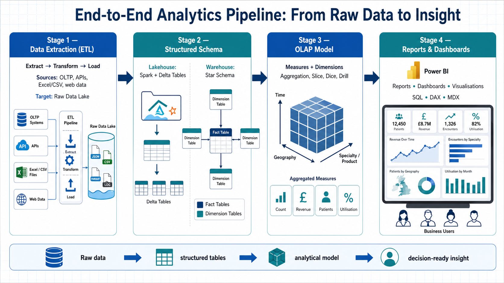

# NHS Waiting List Analytics: Study, Defense, and LinkedIn Notes

## 1. Project Summary

This project is an end-to-end analytics pipeline built around NHS England Referral to Treatment (RTT) waiting time data. The aim is to move beyond the headline waiting list number and investigate whether changes in the waiting list are caused by genuine treatment throughput or by changes in referral demand.

The core analytical question is:

> Is the NHS waiting list improving because more patients are being treated, or because fewer patients are entering the RTT pathway in the first place?

The project uses real NHS England published RTT data covering provider-level monthly activity. It includes Python extraction and cleaning, structured analytical modelling in MySQL, an alternative Databricks Delta Lake implementation, SQL analysis queries, and a Power BI reporting layer.

## 2. Business Problem

The NHS waiting list is often reported as one large national number. That number alone does not explain why the list rises or falls.

A waiting list can shrink for two very different reasons:

- More patients are treated and removed from the list.
- Fewer patients are referred or accepted into the pathway, meaning demand is suppressed before it reaches the waiting list.

This distinction matters because a falling list is not always evidence of improved system performance. If referrals fall sharply while treatment volumes do not increase, the apparent improvement may reflect hidden or delayed demand.

This project was designed to separate:

- Demand: new RTT clock starts, used as a referral demand proxy.
- Supply: completed RTT pathways, split into admitted and non-admitted treatments.
- Backlog: incomplete RTT pathways, representing patients still waiting.
- Quality of access: 18-week breaches and 52+ week long waiters.

## 3. Data Source

The source data comes from NHS England RTT Waiting Times Statistics.

The project extracts provider-level files for:

- Incomplete pathways: patients currently waiting.
- Admitted completed pathways: patients treated through admitted care.
- Non-admitted completed pathways: patients treated without admission.
- New RTT periods: new clock starts, used as a demand proxy.

The files are monthly Excel publications. Older files are `.xls`; newer files are `.xlsx`. The pipeline handles both formats by choosing the correct pandas engine:

- `xlrd` for `.xls`
- `openpyxl` for `.xlsx`

Key source-data detail:

- The reporting period is extracted from row 4, column C of each Excel file.
- The main data table starts at row 13.
- Provider code, provider name, treatment function, wait bands, totals, medians, and percentile waits are standardised into clean CSV outputs.

## 4. End-to-End Architecture

The project follows a typical analytics lifecycle:

1. Data extraction
2. Data processing and normalisation
3. Structured storage and modelling
4. Analytical marts
5. Reporting and dashboarding



This image summarises the full flow: raw operational and public data is extracted, transformed, loaded into structured analytical tables, aggregated into an OLAP-style model, and consumed through reports, dashboards, and visualisations.


### Stage 1: Extract

Script:

- `python/data_download.py`

This script scrapes NHS England financial-year RTT pages and downloads provider-level Excel files into `data/raw/`.

The script searches for four provider-level file types:

- `Incomplete-Provider`
- `NonAdmitted-Provider`
- `Admitted-Provider`
- `New-Periods-Provider`

Important implementation detail:

`NonAdmitted-Provider` is checked before `Admitted-Provider` because the word `Admitted` appears inside `NonAdmitted`. This prevents false matching.

### Stage 2: Transform

Script:

- `python/data_processing.py`

This script reads raw Excel files, cleans the rows, standardises column names, filters valid ODS provider codes, and writes processed CSV files.

Main transformations:

- Standardises NHS source column names into canonical names.
- Filters out blank, aggregate, and non-provider rows.
- Extracts reporting month from the file.
- Converts numeric columns safely.
- Aggregates 52 individual weekly wait bands into 12 reporting bands.
- Deduplicates rows by reporting period, provider, treatment function, and pathway type.

The output is written into:

- `data/processed/incomplete/combined.csv`
- `data/processed/completed_admitted/combined.csv`
- `data/processed/completed_non_admitted/combined.csv`
- `data/processed/new_periods/combined.csv`

### Stage 3: Load and Model

Primary database track:

- MySQL 8.0

Main files:

- `sql/schema.sql`
- `sql/etl.sql`
- `python/load_to_mysql.py`

The project creates a star schema with dimension and fact tables.

Dimension tables:

- `dim_date`
- `dim_trust`
- `dim_region`
- `dim_treatment_function`
- `dim_wait_band`

Fact tables:

- `fact_rtt_incomplete`
- `fact_rtt_completed`
- `fact_rtt_new_periods`

The design separates descriptive context from quantitative measures. This makes the model suitable for analytical queries and Power BI reporting.

### Stage 4: Analytical Marts

The SQL ETL file creates two important mart views:

- `v_monthly_summary`
- `v_national_monthly`

`v_monthly_summary` is the trust, specialty, and month-level view used for detailed analysis.

`v_national_monthly` is the England-level aggregate used for headline trends, referral-vs-treatment analysis, breach rates, and national KPI cards.

### Stage 5: BI and Visualisation

Power BI consumes the mart views and applies DAX measures from:

- `powerbi/measures.md`

The planned dashboard has five pages:

- National Overview
- Core Insight: Referrals vs Reality
- Long Waiter Deep Dive
- Regional Scorecard
- Trust Performance League Table

## 5. Alternative Databricks Track

The project also includes a Databricks implementation.

Files:

- `databricks/01_upload_processed_csvs.md`
- `databricks/02_create_delta_tables.sql`
- `databricks/03_create_gold_views.sql`
- `databricks/04_dbvisualizer_queries.sql`

This track loads the processed CSVs into Delta tables and creates gold views directly on top of the flat table structure.

This demonstrates that the same processed data can support two analytical deployment patterns:

- Relational warehouse style: MySQL star schema.
- Lakehouse style: Databricks Delta tables and gold views.

This is useful when explaining the project because it shows understanding of both traditional data warehousing and modern lakehouse architecture.

## 6. Data Model Explanation

### Fact Tables

Fact tables store measurable events or snapshots.

`fact_rtt_incomplete`

- Monthly snapshot of patients still waiting.
- Grain: date, trust, treatment function, wait band.
- Measure: `patients_waiting`.

`fact_rtt_completed`

- Monthly completed pathways.
- Grain: date, trust, treatment function.
- Measures: `completed_admitted`, `completed_non_admitted`, `total_completed`, median wait, 92nd percentile wait.

`fact_rtt_new_periods`

- Monthly new RTT clock starts.
- Grain: date, trust, treatment function.
- Measure: `new_rtt_periods`.

### Dimension Tables

Dimension tables provide business context.

`dim_date`

- Calendar month, year, financial year, financial quarter, COVID period flag.

`dim_trust`

- Provider code, provider name, region key.

`dim_region`

- NHS England regions.

`dim_treatment_function`

- Clinical specialty codes and specialty groups.

`dim_wait_band`

- Waiting time bands, breach flag, and long-waiter flag.

## 7. Key Metrics

### Total Waiting

Total patients on incomplete RTT pathways.

Why it matters:

This is the headline waiting list metric.

### New Referrals

New RTT clock starts.

Why it matters:

This is the best available consistent proxy for demand entering the RTT system.

Important caveat:

It is not exactly the same as GP referrals. It includes new RTT clock starts, which can include self-referrals and internal referrals.

### Total Treated

Completed admitted plus completed non-admitted pathways.

Why it matters:

This represents supply or throughput.

### Net Flow

Formula:

```text
New Referrals - Total Treated
```

Interpretation:

- Positive: more patients entering than leaving, so the list is likely growing.
- Negative: more patients leaving than entering, so the list may shrink.

### Referral-to-Treatment Ratio

Formula:

```text
New Referrals / Total Treated
```

Interpretation:

- Greater than 1: demand exceeds throughput.
- Less than 1: throughput exceeds new demand.
- If this falls below 1 while the waiting list improves, the reason may be treatment recovery, referral suppression, or both. The wider trend must be interpreted carefully.

### Breach Rate

Formula:

```text
Patients waiting over 18 weeks / Total waiting
```

Why it matters:

The NHS RTT standard expects 92% of patients to be treated within 18 weeks.

### 52+ Week Waiters

Patients waiting more than 52 weeks.

Why it matters:

This is a politically sensitive long-wait metric and a clear indicator of severe backlog pressure.

## 8. Core Analytical Queries

The project includes seven SQL analysis queries in `sql/analysis.sql`.

### Query 1: National Waiting List Trend

Purpose:

Shows the total waiting list over time, including rolling averages, month-on-month change, and year-on-year change.

Defense point:

This provides the headline trend but does not explain causality by itself.

### Query 2: Referrals vs Treatments vs List Size

Purpose:

Compares demand, supply, and backlog in one query.

Defense point:

This is the core query of the project. It tests whether list movement is explained by treatment throughput or referral volume.

### Query 3: Long Waiter Trend

Purpose:

Tracks 52+ week waiters and 18-week breach rates.

Defense point:

This separates general waiting list pressure from severe long-wait pressure.

### Query 4: Specialty-Level Pressure

Purpose:

Identifies treatment functions where demand outstrips treatment capacity.

Defense point:

National-level averages can hide specialty-level stress.

### Query 5: Regional Performance Benchmarking

Purpose:

Compares regions using referral index, breach rate, and long-waiter rate.

Defense point:

This shows whether pressure is evenly distributed or concentrated geographically.

### Query 6: Trust-Level Scorecard

Purpose:

Ranks trusts by breach rate, throughput, median wait, and referral-treatment gap.

Defense point:

This supports operational benchmarking, but rankings should be interpreted carefully because case mix and provider type differ.

### Query 7: Pre/Post COVID Recovery Trajectory

Purpose:

Indexes referrals, treatments, and waiting list size against FY 2019/20.

Defense point:

This converts raw counts into recovery indices, making COVID disruption and recovery easier to compare across regions.

## 9. Power BI Dashboard Story

The dashboard should tell a story, not just display charts.

### Page 1: National Overview

Purpose:

Set the scene with headline KPIs.

Visuals:

- Total waiting list
- Long waiters
- Breach rate
- New referrals
- Total treated
- Waiting list trend with COVID period annotation

Message:

The waiting list is a backlog snapshot, but we need flow metrics to understand why it changes.

### Page 2: Core Insight

Purpose:

Show referrals versus treatments versus list size.

Visuals:

- New referrals and total treated over time
- Waiting list trend
- Referral-to-treatment ratio
- Scatter by trust

Message:

List movement should be interpreted alongside demand and throughput.

### Page 3: Long Waiter Deep Dive

Purpose:

Focus on severe waits.

Visuals:

- 52+ week waiters over time
- Top specialties by long-wait count
- Month-on-month change

Message:

Long waits reveal backlog severity better than the headline total alone.

### Page 4: Regional Scorecard

Purpose:

Compare performance across NHS England regions.

Visuals:

- Region map
- Region by financial year matrix
- Referral index by region

Message:

Backlog pressure is not evenly distributed.

### Page 5: Trust League Table

Purpose:

Provide operational detail.

Visuals:

- Trust ranking table
- Breach rate
- Throughput rate
- Median wait
- Referral signal

Message:

Trust-level analysis helps identify outliers for further investigation.

## 10. Technical Skills Demonstrated

This project demonstrates:

- Python web scraping with `requests` and `BeautifulSoup`.
- Handling messy public-sector Excel files with pandas.
- Automatic handling of `.xls` and `.xlsx` formats.
- ETL pipeline design.
- Data cleaning and standardisation.
- Dimensional modelling.
- Star schema design.
- SQL stored procedures.
- SQL window functions.
- KPI and mart view design.
- Power BI metric design using DAX.
- Databricks and Delta Lake modelling.
- Healthcare analytics domain understanding.
- Analytical storytelling.

## 11. What Makes the Project Strong

The strongest parts of this project are:

- It uses real public data rather than synthetic data.
- It has a clear policy and operational question.
- It separates demand, supply, and backlog.
- It includes both engineering and analytics.
- It provides a dashboard-ready semantic layer.
- It demonstrates both warehouse and lakehouse thinking.
- It includes domain-specific NHS concepts such as RTT, 18-week breaches, 52+ week waiters, financial years, and COVID period flags.

## 12. Limitations and How to Defend Them

A good defense should include limitations. This makes the project more credible.

### Limitation 1: New RTT periods are a proxy for referrals

New RTT clock starts are not exactly GP referrals.

How to defend:

> I used new RTT periods as a consistent demand proxy because it is published across the full period and aligns with the RTT pathway. I describe it as a proxy, not a perfect referral count.

### Limitation 2: Provider case mix differs

Trusts have different specialties, population needs, and operational constraints.

How to defend:

> The trust league table is a benchmarking view, not a final judgement of performance. It highlights outliers for further investigation.

### Limitation 3: COVID data has quality caveats

COVID changed referral behaviour, hospital capacity, and publication quality.

How to defend:

> I flagged March 2020 to March 2022 as a COVID period in `dim_date` so users can include, exclude, or annotate this period in analysis.

### Limitation 4: Region mapping depends on source region code quality

Trust region assignment must be accurate for regional benchmarking.

How to defend:

> The processing captures region codes from the source data and the loader maps those to region keys. For production use, I would validate this against an authoritative ODS organisation reference.

### Limitation 5: MySQL loader needs column alignment review

There is a known implementation caveat: the processed CSV column names and some loader references should be reviewed to ensure they are fully aligned before relying on a fresh MySQL reload.

Examples:

- Processing emits `band_0_5_wks`, while the loader references `band_0_5_weeks`.
- Processing emits `total_completed`, while the loader references `total_periods`.
- Processing emits `new_rtt_periods`, while the loader references `total_periods` in the new-period loader.

How to defend:

> The architecture and modelling are complete, and the Databricks track consumes the processed CSVs directly. Before productionising the MySQL load path, I would align the loader column names with the processed output and add automated validation tests to catch zero-load or schema drift issues.

This is not something to hide. Presenting it clearly shows engineering maturity.

## 13. Likely Interview or Presentation Questions

### Why did you choose a star schema?

Because the data is analytical rather than transactional. A star schema separates facts from dimensions, supports fast aggregation, and makes Power BI modelling easier.

### What is the grain of the main fact table?

For `fact_rtt_incomplete`, the grain is one row per reporting month, trust, treatment function, and wait band.

### Why separate incomplete, completed, and new periods?

Because they represent different concepts:

- Incomplete pathways are backlog.
- Completed pathways are throughput.
- New RTT periods are demand entering the system.

Combining them too early would hide the flow logic.

### Why use 18 weeks and 52 weeks?

18 weeks is the NHS RTT standard. 52+ weeks identifies very long waits and is commonly used as a severe backlog metric.

### Why did you build Databricks as well as MySQL?

To show two valid analytical architectures:

- MySQL represents a traditional relational warehouse/star schema.
- Databricks represents a lakehouse pattern using files, Delta tables, and gold views.

### What would you improve next?

The next improvements would be:

- Add automated tests for processing and loading.
- Add source data validation checks.
- Add authoritative ODS trust-region mapping.
- Align and harden the MySQL loader column mappings.
- Add CI checks for SQL and Python formatting.
- Publish a final Power BI screenshot or interactive demo.

### What is the main insight?

The main insight is that waiting list movement cannot be interpreted from backlog size alone. You need to compare referrals, treatments, and waiting list changes together. A shrinking or stabilising waiting list may reflect improved throughput, reduced referrals, or a combination of both.

## 14. Suggested Presentation Structure

Use this order for a project defense:

1. Start with the business question.
2. Explain the source data and why it matters.
3. Show the pipeline architecture.
4. Explain the star schema and fact/dimension design.
5. Walk through the core metrics.
6. Present the key SQL analysis.
7. Show or describe the Power BI dashboard pages.
8. Explain limitations honestly.
9. End with what you learned and what you would improve.

## 15. Short Verbal Pitch

This is a project where I built an end-to-end analytics pipeline using NHS England RTT waiting list data. The goal was to understand whether changes in the waiting list were caused by improved treatment throughput or by lower referral demand.

I scraped monthly provider-level Excel files from NHS England, cleaned and standardised them with Python, modelled the data into a star schema in MySQL, and created analytical mart views for Power BI. I also built an alternative Databricks Delta Lake track to show how the same processed data could be used in a lakehouse architecture.

The key analytical idea is to separate backlog, demand, and supply. Incomplete pathways show the waiting list, completed pathways show treatments, and new RTT periods act as a demand proxy. By comparing these together, the analysis gives a more honest picture than the headline waiting list number alone.

## 16. LinkedIn Post Draft

I recently completed an end-to-end NHS Waiting List Analytics project using real NHS England Referral to Treatment data.

The goal was to answer a simple but important question:

Is the waiting list changing because more patients are being treated, or because fewer patients are entering the system?

To explore this, I built a full analytics pipeline:

- Python ETL to scrape and process monthly NHS England RTT Excel files
- Data cleaning and standardisation across `.xls` and `.xlsx` formats
- Star schema modelling in MySQL
- Fact tables for waiting list snapshots, completed treatments, and new RTT periods
- Dimension tables for date, trust, region, treatment function, and wait bands
- SQL analytical queries using CTEs, window functions, rolling averages, and recovery indices
- Power BI dashboard design with DAX measures
- Alternative Databricks Delta Lake implementation for a lakehouse-style workflow

The key lesson from the project is that a headline backlog number is not enough. To understand performance properly, we need to look at demand, throughput, and waiting list movement together.

This project helped me apply data engineering, dimensional modelling, SQL analytics, healthcare domain knowledge, and BI storytelling in one workflow.

Tech stack:

Python, pandas, BeautifulSoup, MySQL, SQL, Databricks, Delta Lake, Power BI, DAX

## 17. LinkedIn Carousel Outline

Slide 1:

Title: NHS Waiting List Analytics

Subtitle: From raw public data to decision-ready insight

Slide 2:

The problem:

A waiting list can fall because more people are treated or because fewer people are referred. These are not the same thing.

Slide 3:

The data:

NHS England RTT monthly provider-level files:

- Incomplete pathways
- Completed admitted pathways
- Completed non-admitted pathways
- New RTT periods

Slide 4:

The pipeline:

Extract raw Excel files, clean with Python, load to structured tables, build marts, visualise in Power BI.

Slide 5:

The model:

Fact tables:

- Waiting list snapshot
- Completed treatments
- New RTT periods

Dimension tables:

- Date
- Trust
- Region
- Treatment function
- Wait band

Slide 6:

The core insight:

Backlog = what is waiting.

Referrals = what is entering.

Treatments = what is leaving.

You need all three to understand the system.

Slide 7:

The dashboard:

- National overview
- Referral vs treatment analysis
- Long waiter deep dive
- Regional scorecard
- Trust league table

Slide 8:

What I learned:

Data engineering is not just moving data. It is designing a model that helps answer the right question.

## 18. README Portfolio Summary

This project analyses NHS England Referral to Treatment waiting list data using an end-to-end analytics pipeline. It extracts monthly provider-level Excel files, processes and standardises them with Python, models them into a MySQL star schema, creates SQL mart views, and defines Power BI dashboard measures.

The analysis separates backlog, demand, and treatment throughput by comparing incomplete pathways, new RTT clock starts, and completed pathways. This allows the project to test whether changes in the waiting list reflect genuine treatment recovery or reduced referral demand.

An alternative Databricks Delta Lake implementation is included to demonstrate how the same processed data can support a lakehouse workflow.

## 19. Defense Checklist

Before presenting, be ready to explain:

- What RTT means.
- Difference between incomplete, completed, and new RTT periods.
- Why new RTT periods are used as a referral proxy.
- Why a star schema is appropriate.
- What the grain of each fact table is.
- How wait bands are aggregated.
- Why the COVID flag exists.
- What the referral-to-treatment ratio means.
- What 18-week breach rate means.
- What 52+ week waiters mean.
- Why Power BI consumes mart views rather than raw fact tables.
- What limitations exist and how you would improve the project.

## 20. One-Sentence Summary

This project turns raw NHS England RTT waiting list files into a structured analytics model and Power BI-ready reporting layer to investigate whether waiting list changes are driven by treatment throughput or referral demand.
